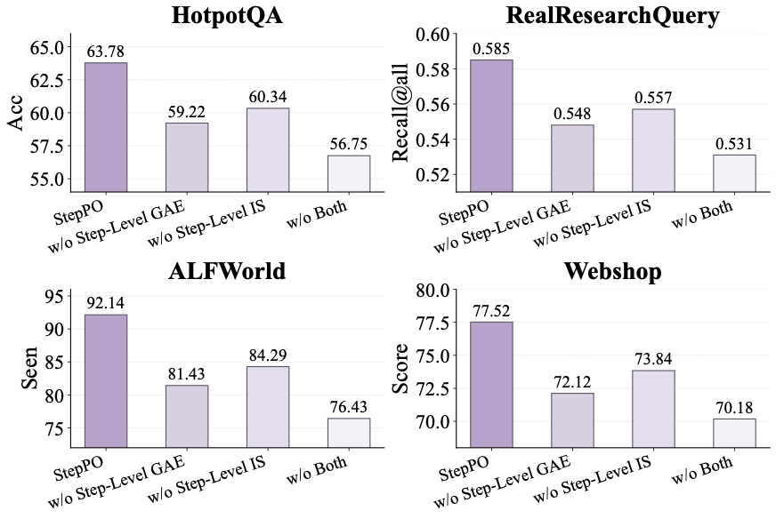
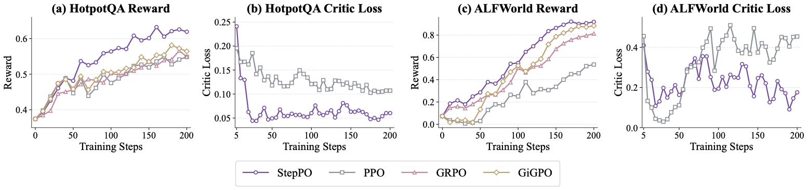
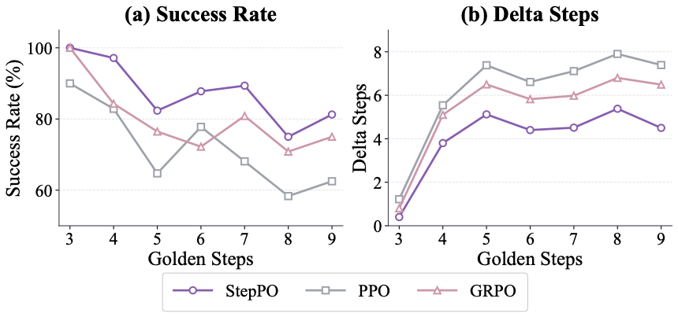
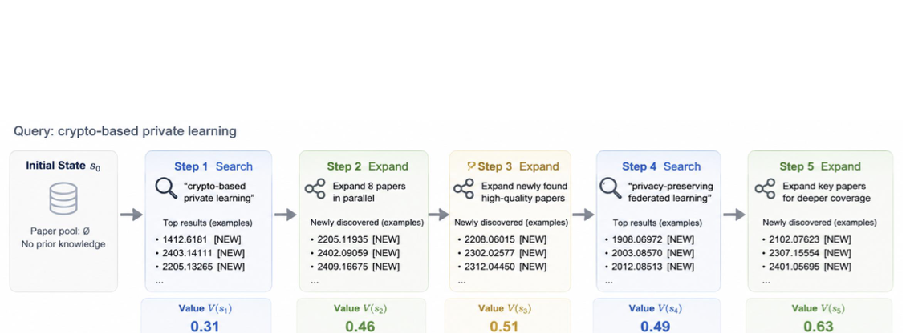

<div align="center">
  <h1>
        🧭 StepPO: Step-Aligned Policy Optimization for <br> Agentic Reinforcement Learning
  </h1>
</div>

---

## 📖 Abstract

Agentic reinforcement learning (RL) is emerging as a critical post-training paradigm for improving LLM agent capabilities. Existing RL algorithms for LLMs largely follow the token-centric paradigm inherited from RLHF and RLVR, where tokens serve as the basic units for modeling and optimization. However, this paradigm introduces a granularity mismatch in agentic RL: LLM agents make environment-facing decisions at the step level, while standard RL objectives optimize token-level predictions or assign trajectory-level credit. In this work, we propose **StepPO**, a step-centric paradigm for agentic RL via step-aligned policy optimization. StepPO reformulates agentic RL from a token-level Markov Decision Process (MDP) into a step-level MDP, where interaction steps serve as the basic trajectory representation. It further performs step-level credit assignment, aligning value estimation and policy optimization with complete agent actions. Experiments across multi-hop QA, academic paper search, ALFWorld, and WebShop show that StepPO consistently outperforms representative RL baselines. Further analyses reveal that step-centric optimization improves decision quality, stabilizes training, and better matches long-horizon tool-augmented agent behavior. Our code is available after anonymous review.


## ✨ Motivation


**StepPO** starts from a simple observation: LLM agents do not act one token at a time. They observe the environment, generate a complete response or tool call, receive feedback, and then move to the next interaction state.

Existing agentic RL methods often suffer from a granularity mismatch:

- 🎯 **Token-level MDPs** model each token as an action, although individual tokens are rarely meaningful environment decisions.
- 📦 **Trajectory-level credit** assigns one coarse reward to an entire rollout, making it hard to locate useful or harmful intermediate steps.
- 🔁 **Long-horizon interaction** requires credit to flow across complete tool-use and environment-action steps, not across surface text tokens alone.

StepPO aligns the MDP formulation, trajectory representation, and credit assignment unit around the **interaction step**, the natural decision unit of LLM agents.

<br clear="left"/>


## 🌟 Framework

<div align="center">

<p><em>Figure 1: Step-level credit assignment in StepPO.</em></p>
</div>

StepPO maintains step-native transition records throughout rollout and training. Each record contains the current state, a complete generated action, reward, and the next state induced by environmental feedback. Three core designs make the step-level view operational:

- **Step-Level MDP Formulation** — Agent execution is represented as a sequence of interaction steps. At each step, the policy observes the current state, emits a complete action such as a tool call, search query, answer, or text-world command, receives reward, and transitions to the next state.

- **Step-Level Trajectory Representation** — Rollouts are stored as step-native records instead of only one flattened token sequence. This preserves step boundaries while retaining token-level likelihoods needed by standard LLM RL trainers.

- **Step-Level Credit Assignment** — StepPO estimates values at step boundaries, computes GAE over the step timeline, and broadcasts the resulting step advantage to the valid generated tokens of the same action. This keeps policy gradients compatible with token-level training while assigning credit at the agent-decision level.

## 🚀 Quick Start

This guide provides step-by-step instructions to set up the environment, prepare task data, and run StepPO training.

### 1. Environment Setup

We recommend using Conda with Python 3.10+.

```bash
git clone <repo_url>

# Navigate into the cloned repository directory.
cd StepPO

# Create and activate a conda environment.
conda create -n steppo python=3.10
conda activate steppo

# Install the veRL backend and project dependencies.
pip install -e verl
pip install -r recipe/hotpotqa/requirements.txt
```

Depending on the target environment, you may also need to install task-specific dependencies for ALFWorld, WebShop, or Paper Search.

### 2. Data Preparation

Prepare the benchmark data before training. For HotpotQA:

```bash
python recipe/hotpotqa/prepare_hotpotqa_arft.py \
  --output_dir data/corpus/hotpotqa \
  --corpus_output_path data/corpus/hotpotqa_corpus/hpqa_corpus.jsonl
```

Other environments provide their own preparation scripts under `recipe/`.

### 3. Run StepPO

Launch step-level advantage training with the provided scripts:

```bash
# Step-level advantage (StepPO)
bash examples/run_hotpotqa_step_adv.sh

# Token-level advantage baseline
bash examples/run_hotpotqa_token_adv.sh

# Trajectory-level GRPO baseline
bash examples/run_hotpotqa_grpo.sh
```

The same script pattern is available for WebShop, ALFWorld, and Paper Search:

```bash
bash examples/run_webshop_step_adv.sh
bash examples/run_alfworld_step_adv.sh
bash examples/run_papersearch_step_adv.sh
```

### 4. Key Configuration

StepPO is controlled by two main configuration axes: the advantage estimator and the actor policy loss.

```bash
# Step-level GAE (StepPO)
algorithm.adv_estimator=gae
actor_rollout_ref.actor.policy_loss.loss_mode=gspo

# Token-level GAE baseline
algorithm.adv_estimator=token_gae

# Trajectory-level GRPO baseline
algorithm.adv_estimator=grpo
```

| Parameter | Description | Options |
|---|---|---|
| `algorithm.adv_estimator` | Credit-assignment granularity | `gae` (step), `token_gae` (token), `grpo` (trajectory) |
| `actor_rollout_ref.actor.policy_loss.loss_mode` | Policy optimization objective | `gspo`, `ppo`, `reinforce`, etc. |
| `actor_rollout_ref.rollout.agent.default_agent_flow` | Task-specific agent flow | `hotpotqa_agent`, `webshop_agent`, `alfworld_agent`, `paper_search_agent` |


## 💪 Performance

We evaluate StepPO across multi-hop QA, academic paper search, ALFWorld, and WebShop with Qwen3-1.7B and Qwen3-4B-Instruct-2507 backbones. StepPO obtains the best result on every reported metric.

| Backbone | Method | HotpotQA | 2Wiki | MuSiQue | Paper F1@All | ALFWorld Seen | ALFWorld Unseen | WebShop Score | WebShop Succ. |
|---|---|---:|---:|---:|---:|---:|---:|---:|---:|
| Qwen3-1.7B | PPO | 38.00 | 50.12 | 16.55 | 0.284 | 67.14 | 69.40 | 59.12 | 34.60 |
| Qwen3-1.7B | GRPO | 36.76 | 48.30 | 16.88 | 0.275 | 73.57 | 75.37 | 63.15 | 36.20 |
| Qwen3-1.7B | GiGPO | 40.85 | 52.43 | 18.37 | 0.298 | 70.00 | 69.40 | 66.92 | 41.80 |
| Qwen3-1.7B | **StepPO** | **44.86** | **56.17** | **21.56** | **0.314** | **75.00** | **79.10** | **69.88** | **45.00** |
| Qwen3-4B | PPO | 56.75 | 58.92 | 19.82 | 0.303 | 76.43 | 72.39 | 70.18 | 46.00 |
| Qwen3-4B | GRPO | 56.61 | 63.33 | 25.07 | 0.294 | 81.43 | 74.63 | 65.83 | 44.20 |
| Qwen3-4B | GiGPO | 58.14 | 61.27 | 23.50 | 0.306 | 88.57 | 79.10 | 67.13 | 50.00 |
| Qwen3-4B | **StepPO** | **63.78** | **66.16** | **29.87** | **0.327** | **92.14** | **85.82** | **77.52** | **57.80** |

StepPO improves over token-level RL methods and over step-MDP methods that still use trajectory-level credit, suggesting that both the MDP formulation and credit assignment should respect environment-facing interaction steps.


## 📊 Analysis

<div align="center">

<p><em>Figure 3: Ablation study over StepPO components.</em></p>
</div>

The ablation study verifies that both step-level GAE and step-level importance sampling contribute to performance. Removing either component degrades results, while removing both yields the weakest variant.

<div align="center">

<p><em>Figure 4: Training dynamics on HotpotQA and ALFWorld.</em></p>
</div>

StepPO achieves stronger reward curves and more stable critic loss than PPO, GRPO, and GiGPO, indicating that step-centric optimization improves both policy quality and value estimation.

<div align="center">

<p><em>Figure 5: Step-wise difficulty analysis on ALFWorld.</em></p>
</div>

As task horizons grow, StepPO maintains higher success rates and a smaller gap between agent steps and human-annotated golden steps, showing better control over long-horizon interaction.


## 📋 Example Output

<div align="center">

<p><em>Figure 6: Paper Search case study with step-level value and advantage.</em></p>
</div>

The case study shows how StepPO assigns credit to specific interaction decisions. Effective search and citation-expansion steps receive positive advantages, while low-yield steps receive smaller or negative advantages. This supports the central claim that step-level credit better matches multi-turn tool-augmented agent behavior.


## 🌐 Supported Environments

| Environment | Description | Agent Flow |
|---|---|---|
| **HotpotQA** | Multi-hop question answering with Wikipedia retrieval | `HotpotQAAgentFlow` |
| **Paper Search** | Academic paper discovery with search and citation expansion | `PaperSearchAgentFlow` |
| **ALFWorld** | Text-world embodied household task execution | `AlfworldAgentFlow` |
| **WebShop** | E-commerce web navigation and product search | `WebShopAgentFlow` |

Each recipe includes an agent flow, reward function, prompt template, data preparation utilities, and Hydra configuration.


## 🧩 Key Contributions

- **Step-Level MDP** — Reformulates agentic RL around complete environment-facing interaction steps instead of individual generated tokens.
- **Step-Level Credit Assignment** — Computes advantages over the step timeline and broadcasts each step advantage to the corresponding generated action tokens.
- **Step-Aligned Policy Optimization** — Uses length-normalized step-level importance ratios to stabilize PPO-style updates for multi-token actions.
- **Broad Agentic Evaluation** — Demonstrates consistent gains across QA, retrieval, embodied text-world interaction, and web navigation tasks.


## 🙏 Acknowledgement

This repository builds on strong open-source infrastructure and benchmark resources. We appreciate the following projects:

- [veRL](https://github.com/volcengine/verl) - Reinforcement learning backend for LLM training
- [Agent-R1](https://github.com/0russwest0/Agent-R1) - Agent training framework and design inspiration
- [HotpotQA](https://hotpotqa.github.io/) - Multi-hop QA benchmark
- [ALFWorld](https://github.com/alfworld/alfworld) - Text-world embodied agent benchmark
- [WebShop](https://github.com/princeton-nlp/WebShop) - Web-based shopping agent benchmark


## 📌 Citation

Citation information will be added after anonymous review.
