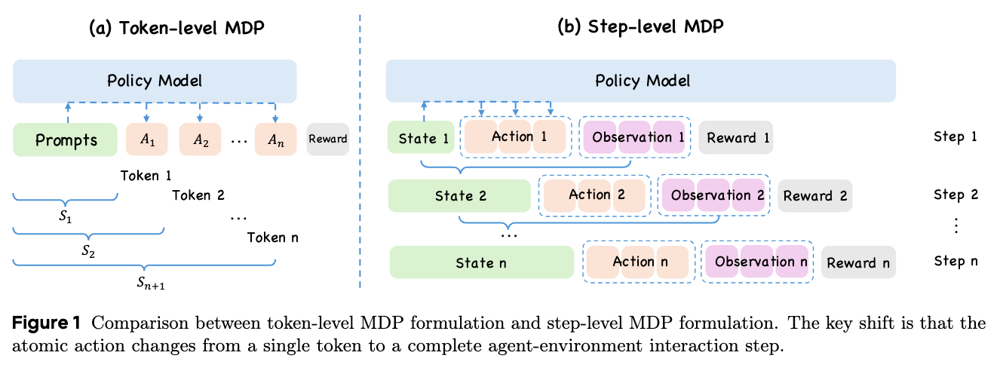
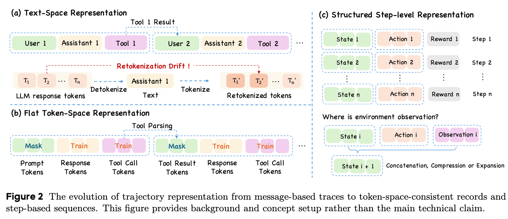
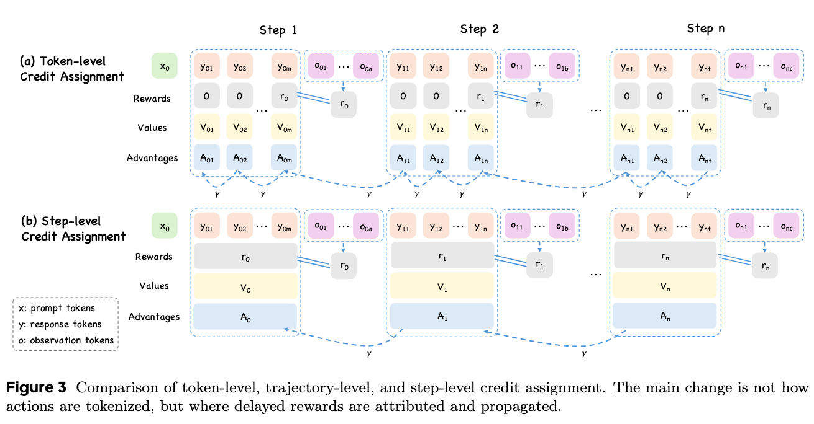
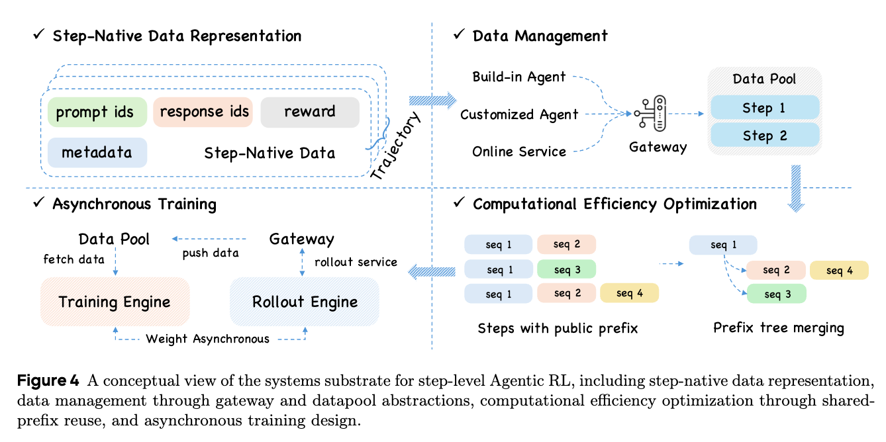

# StepPO: Step-Aligned Policy Optimization for Agentic Reinforcement Learning

> 🧠 StepPO advocates a **step-level** perspective on Agentic RL: the conventional token-level MDP should be advanced to a **step-level MDP**, and the *step*, rather than the *token*, should be regarded as the proper action representation for LLM agents.
> 
> ⚙️ We propose **step-level credit assignment** as the natural optimization counterpart, aligning policy optimization and reward propagation with the granularity of agent decisions.

📄 **Paper**: available after anonymous review.

## 🚀 From Token-Level to Step-Level Agentic RL

Agentic RL is emerging as a central post-training paradigm for empowering LLMs with agentic capabilities such as decision making, tool use, and environment interaction. However, the token-centric modeling and optimization paradigm inherited from RLHF/RLVR is becoming increasingly inadequate for multi-turn interactive settings.

> **Token-Level MDP (PPO, Reinforce++):**
> Each token is treated as an atomic action. Credit assignment operates at token granularity — too local and noisy for long-horizon agent decisions.
>
> **Trajectory-Level Credit (GRPO, RLOO):**
> The entire trajectory receives a single reward signal. Credit assignment is too coarse to identify the contribution of intermediate decisions.
>
> **Step-Level MDP + Step-Level Credit (StepPO):**
> Each complete interaction round forms the proper transition unit. Credit assignment aligns with the step — the natural granularity of agent behavior.

<!-- IMAGE PLACEHOLDER: Figure 1 — Comparison between token-level MDP and step-level MDP formulation -->

<!-- Suggested image: Figure 1 from the paper -->

<!-- Path suggestion: assets/token_vs_step_mdp.png -->

| Method | MDP Formulation | Credit Assignment |
|---|---|---|
| PPO | Token-level | Token-level |
| Reinforce++ | Token-level | Token-level |
| GRPO | Token-level | Trajectory-level |
| RLOO | Token-level | Trajectory-level |
| LightningRL | Step-level | Trajectory-level |
| **StepPO** | **Step-level** | **Step-level** |

---

## 🧠 Step-Level MDP Formulation



In StepPO, we redefine the MDP for LLM agents at the granularity of interaction steps rather than individual tokens:

### Core Components



* **State.**
  The prompt and environment observation at the start of an interaction turn.

* **Action.**
  The *entire model response* generated in one turn (thought + tool call), rather than a single token.

* **Transition.**
  The environment's response (tool output, observation update) to the agent's complete action.

* **Reward.**
  Delayed and sparse reward signals that must be properly propagated back to intermediate steps via step-level credit assignment.

This formulation captures the natural decision-making granularity of LLM agents — each step involves reading observations, reasoning, and producing a complete action, followed by an environment transition that yields new information.

---

## ⚙️ Step-Level Credit Assignment

Training multi-turn agents with standard RL methods faces a fundamental **granularity mismatch**:

* **Token-level PPO**
  ❌ Too local — individual tokens are not meaningful decision units for tool use and environment interaction
* **Trajectory-level GRPO**
  ❌ Too coarse — cannot distinguish which intermediate steps contributed to the outcome

### ✨ Our Solution: Step-Level GAE

StepPO implements **step-level Generalized Advantage Estimation (GAE)**, which aligns credit assignment exactly with the agent's interaction granularity:



**Key properties of step-level credit assignment:**

* Treats each *complete agent response* (thought + action) as an atomic action unit
* Performs **step-level advantage estimation** — rewards are summed within each step, then GAE propagates credit across steps
* The critic estimates **state values at step boundaries** (before the first response token of each step)
* Advantages are whitened at step level, then broadcast to token level for policy gradient
* Significantly improves **training stability and credit accuracy** over token-level alternatives

---

## 🏗️ Systems Design

Step-level Agentic RL places unique demands on training infrastructure. StepPO is built on top of **veRL** and addresses these challenges through:



* **Token-space consistency**: Rollout and training operate on the same tokenized data, avoiding retokenization drift that can break step-aligned learning
* **Trajectory-native data management**: Each trajectory is composed of multiple steps, tracked via `trajectory_uids` and `step_indices` for proper credit assignment
* **Asynchronous agent rollout**: Agent-environment interaction is managed via `AgentFlowManager`, supporting heterogeneous environments with variable step counts
* **Flexible advantage estimation**: Three modes supported — `gae` (step-level), `token_gae` (token-level), and `grpo` (trajectory-level) — configurable via Hydra

---

## 🌐 Supported Environments

StepPO provides recipe-based support for diverse agent benchmarks:

| Environment | Description | Agent Flow |
|---|---|---|
| **WebShop** | E-commerce web navigation and product search | `WebShopAgentFlow` |
| **ALFWorld** | Embodied household task execution in TextWorld | `AlfworldAgentFlow` |
| **HotpotQA** | Multi-hop question answering with retrieval | `HotpotQAAgentFlow` |
| **Paper Search** | Autonomous academic paper discovery | `PaperSearchAgentFlow` |

Each recipe includes: agent flow definition, reward function, prompt templates, data preparation scripts, and Hydra configuration.

---

## 📊 Experimental Results

Preliminary experiments on HotpotQA demonstrate that step-level credit assignment consistently outperforms token-level PPO in multi-step agent settings.

<!-- IMAGE PLACEHOLDER: Main experimental results table/figure -->

<!-- Suggested image: Table or figure showing HotpotQA results -->

<!-- Path suggestion: assets/main_results.png -->

### Key Findings

* **Step-level GAE** consistently outperforms **token-level GAE** across different model sizes
* Step-aligned credit assignment better captures the contribution of intermediate agent decisions
* Aligning the optimization granularity with the interaction granularity leads to more stable training and improved sample efficiency

<!-- IMAGE PLACEHOLDER: Training curves or ablation results -->

<!-- Suggested image: Training curves comparing step-level vs token-level -->

<!-- Path suggestion: assets/training_curves.png -->

---

## 🛠️ Quick Start

### Training

Training is launched via `arft.main_agent_ppo` with Hydra configuration. Example scripts are provided in `examples/`:

```bash
# Step-level advantage (StepPO)
bash examples/run_hotpotqa_step_adv.sh

# Token-level advantage (baseline)
bash examples/run_hotpotqa_token_adv.sh
```

Available training configurations:

| Script | Task | Advantage | GPUs |
|---|---|---|---|
| `run_hotpotqa_step_adv_mlflow_4gpu.sh` | HotpotQA | Step GAE | 4 |
| `run_hotpotqa_token_adv_mlflow_4gpu.sh` | HotpotQA | Token GAE | 4 |
| `run_webshop_step_adv_mlflow_4gpu.sh` | WebShop | Step GAE | 4 |
| `run_webshop_token_adv_mlflow_4gpu.sh` | WebShop | Token GAE | 4 |
| `run_alfworld_step_adv_mlflow_4gpu.sh` | ALFWorld | Step GAE | 4 |
| `run_alfworld_token_adv_mlflow_4gpu.sh` | ALFWorld | Token GAE | 4 |
| `run_papersearch_step_adv_mlflow_4gpu.sh` | Paper Search | Step GAE | 4 |
| `run_papersearch_token_adv_mlflow_4gpu.sh` | Paper Search | Token GAE | 4 |

### Key Configuration

StepPO involves two core configuration axes — **advantage estimator** and **policy loss**:

```bash
# Step-level GAE (StepPO)
algorithm.adv_estimator=gae
actor_rollout_ref.actor.policy_loss.loss_mode=gspo

# Token-level GAE (baseline)
algorithm.adv_estimator=token_gae
actor_rollout_ref.actor.policy_loss.loss_mode=gspo

# Trajectory-level GRPO
algorithm.adv_estimator=grpo
```

| Parameter | Description | Options |
|---|---|---|
| `algorithm.adv_estimator` | Credit assignment granularity | `gae` (step), `token_gae` (token), `grpo` (trajectory) |
| `actor_rollout_ref.actor.policy_loss.loss_mode` | Policy gradient loss function | `gspo`, `ppo`, `reinforce`, etc. |

---

## 🧩 Key Contributions

* 🧠 **Step-Level MDP**: Advancing from token-level to step-level MDP formulation for Agentic RL, where the step is the proper action representation
* ⚙️ **Step-Level Credit Assignment**: Aligning policy optimization and reward propagation with the natural granularity of agent decisions
* 🏗️ **Systems Design**: Addressing token-space consistency, trajectory-native data management, and asynchronous agent rollout
* 📈 **Empirical Evidence**: Consistent gains of step-level over token-level optimization across multi-step agent benchmarks

---

## 📌 Citation

Citation information will be added after anonymous review.
